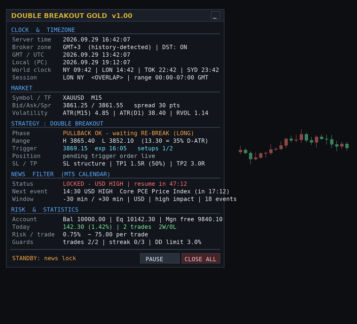

# Double Breakout Gold EA (MT5 / MQL5)

Professional **Double Breakout** Expert Advisor for **XAU/USD (Gold)** with:

* 2-stage breakout entry (range break → pullback → **re-break**)
* automatic **SL / TP**, partial TP, breakeven, ATR trailing, end-of-day exit
* **broker timezone + DST auto-detection** and a live world clock
* **MT5 Economic-Calendar news filter** — trading is switched **OFF 30 min before**
  an event and switched back **ON 30 min after** it (fully configurable)
* full **on-chart dashboard** with control buttons (Pause / Close all / Minimise)



---

## 1. Files

```
mt5/
├── Experts/DoubleBreakoutGold/
│   ├── DoubleBreakoutGold.mq5     <- the EA (compile this one)
│   ├── DBG_Utils.mqh              <- enums, helpers, DST maths
│   ├── DBG_TimeZone.mqh           <- broker GMT offset + DST detection, world clock
│   ├── DBG_News.mqh               <- economic calendar news filter
│   └── DBG_Dashboard.mqh          <- on-chart panel
├── Scripts/DBG_ExportCalendarCSV.mq5   <- calendar -> CSV (for backtesting news)
└── Presets/XAUUSD_M15_Default.set
docs/STRATEGY.md                   <- full strategy specification + research sources
```

## 2. Installation (Hinglish quick start)

1. MT5 me `File → Open Data Folder` kholo.
2. Poora folder `mt5/Experts/DoubleBreakoutGold` copy karke
   `MQL5/Experts/DoubleBreakoutGold` me paste kar do (saari 5 files ek hi folder me rehni chahiye,
   includes relative hain).
3. `mt5/Scripts/DBG_ExportCalendarCSV.mq5` ko `MQL5/Scripts/` me daal do.
4. MetaEditor me `DoubleBreakoutGold.mq5` open karo → **F7 (Compile)**.
5. MT5 me `XAUUSD M15` chart kholo → Navigator se EA drag karo → **Algo Trading ON**.
6. Panel upar-left corner me aa jayega: server time, timezone, session, news status sab live.

> Tools → Options → Expert Advisors me "Allow Algo Trading" on hona chahiye.
> News filter ke liye terminal ka **Calendar** enable + connected hona zaroori hai.

## 3. The strategy in one picture

```
        ┌── 2nd breakout = ENTRY (buy stop)
        │
  high ─┼───────────●─────────────────────  b1 peak (breakout leg extreme)
        │          ╱ ╲        ╱
        │         ╱   ╲──●──╱   <- pullback 20–70% (>70% = setup cancelled)
 range  │────────●───────────────────────── range high  (1st breakout)
 (Asia) │▒▒▒▒▒▒▒▒
        │▒▒▒▒▒▒▒▒  00:00–07:00 GMT session range
 low    │▒▒▒▒▒▒▒▒───────────────────────── range low
                                  SL = pullback swing ± buffer (ATR clamped)
                                  TP1 = 1.5R (50% off) · TP2 = 3R · EoD exit
```

Only the **second** breakout is traded. That single filter removes most of the
"first-poke" false breaks that make plain opening-range breakout systems net-zero
after spread on CFD accounts.

Full rule set, filters and research references: [`docs/STRATEGY.md`](docs/STRATEGY.md).

## 4. Key inputs

| Group | Input | Default | Meaning |
|---|---|---|---|
| Session | `InpTimeBase` | GMT | Session times are GMT or broker time |
| Session | `InpRangeStart / InpRangeEnd` | 00:00 / 07:00 | Asian range window |
| Session | `InpTradeEnd` | 18:00 | last time a new trade may open |
| Session | `InpFlattenTime` | 20:30 | everything closed (no overnight risk) |
| Logic | `InpMode` | REBREAK | REBREAK / TWO-LEVEL (PDH-PDL) / BOTH |
| Logic | `InpEntryType` | STOP | pending stop order vs. close-confirmation |
| Logic | `InpMinPullbackPct / InpMaxPullbackPct` | 20 / 70 | valid pullback band |
| Logic | `InpMinRangeAtrPct / InpMaxRangeAtrPct` | 12 / 70 | range must be a sane % of daily ATR |
| Risk | `InpRiskPercent` | 0.75 | % of balance risked per trade |
| Risk | `InpSlMode` | STRUCTURE | swing / opposite range side / ATR |
| Risk | `InpTp1R / InpTp2R` | 1.5 / 3.0 | partial + final targets in R |
| Guards | `InpMaxTradesPerDay`, `InpMaxConsecLosses`, `InpDailyLossPct` | 2 / 3 / 3% | daily circuit breakers |
| News | `InpNewsMinsBefore / After` | 30 / 30 | **off 30 min before, on 30 min after** |
| News | `InpNewsImportance` | HIGH | high / high+medium / all |
| News | `InpNewsClosePositions` | true | flatten 5 min before the release |

## 5. Backtesting with the news filter

The calendar API is not always available in the Strategy Tester, so:

1. Run `DBG_ExportCalendarCSV` once on a connected terminal
   (writes `Common\Files\DBG_News.csv`).
2. Keep `InpNewsUseCsv = true`, `InpNewsCsvCommon = true`.
3. Backtest in **Every tick based on real ticks** with real spread.

The EA automatically prefers the live calendar and falls back to the CSV.

## 6. Risk notice

Breakout edges on gold are thin relative to spread and slippage. Forward-test on a
demo account for at least a few weeks, keep `InpRiskPercent` ≤ 1 %, and never run the
EA on an account you cannot afford to draw down. This code is provided as-is for
research and education — it is not financial advice.
